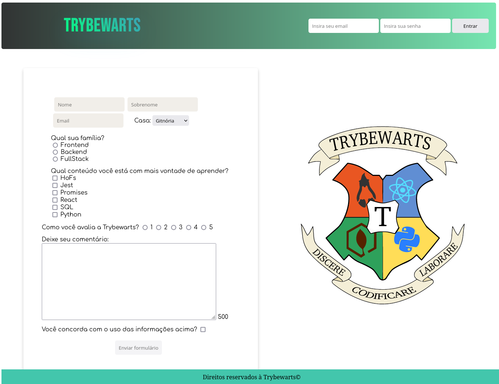

# Trybewarts Project

> O projeto consiste em uma aplicação que simula um formulário utilizando HTML, CSS e JS manipulando elementos do DOM.

## 💻 Pré-requisitos

Para jogar, verifique os seguintes requisitos:

- Você ter instalado `VSCode e extensão Live Server`

Obs.: essa etapa é necessária para que o background da página renderize corretamente!

⚠️ Obs.: Caso não tenha as ferramentas acima, você pode acessar a aplicação <a href="" >aqui</a>

## ☕ Usando Trybewarts Project

Uma vez com a aplicação iniciada em seu navegador, basta preencher o formulário!

## 📫 Contribuindo para o Trybewarts Project!

1. Clone este repositório.
2. Crie uma branch: `git checkout -b nome-da-branch`.
3. Faça suas alterações e confirme-as: `git commit -m 'mensagem-de-commit'`
4. Envie para o branch original: `git push origin nome-do-projeto / local`
5. Crie a solicitação de pull request.

Como alternativa, consulte a documentação do GitHub em [como criar uma solicitação pull](https://help.github.com/en/github/collaborating-with-issues-and-pull-requests/creating-a-pull-request).

## 🤝 Colaboradores

Agradecimento à seguinte pessoa que contribuíu para este projeto; foi um prazer codar com você!

<table>
  <tr>
    <td align="center">
      <a href="https://github.com/gabrielhdn">
         
        
          <b>Gabriel Herdina</b>
        
      </a>
    </td>
  </tr>
</table>

[⬆ Voltar ao topo](#trybewarts-project) 
